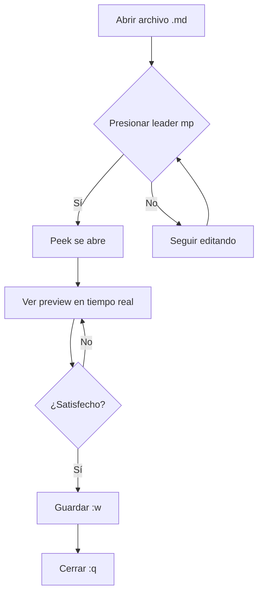

# 🧪 Test de Peek.nvim

Este es un archivo de prueba para verificar que peek funciona correctamente.

## ✅ ¿Qué deberías ver?

Cuando abras este archivo en neovim y presiones `<leader>mp`:
1. Se abrirá una ventana de preview (webview o navegador)
2. Verás este markdown **renderizado** con formato
3. Los cambios que hagas aparecerán **en tiempo real**

## 🎨 Features a probar

### 1. Formato básico

- **Texto en negrita**
- *Texto en cursiva*
- ~~Texto tachado~~
- `código inline`

### 2. Listas

#### Lista numerada:
1. Primer elemento
2. Segundo elemento
3. Tercer elemento

#### Lista con checkboxes:
- [x] Tarea completada
- [ ] Tarea pendiente
- [ ] Otra tarea pendiente

### 3. Código con syntax highlighting

```javascript
// Ejemplo JavaScript
function saludar(nombre) {
  console.log(`¡Hola, ${nombre}!`);
  return true;
}

saludar("Peek");
```

```python
# Ejemplo Python
def fibonacci(n):
    if n <= 1:
        return n
    return fibonacci(n-1) + fibonacci(n-2)

print(fibonacci(10))
```

```ruby
# Ejemplo Ruby
class Persona
  attr_accessor :nombre, :edad

  def initialize(nombre, edad)
    @nombre = nombre
    @edad = edad
  end

  def saludar
    puts "Hola, soy #{@nombre} y tengo #{@edad} años"
  end
end
```

### 4. Tabla

| Herramienta | Propósito | Estado |
|-------------|-----------|--------|
| Peek | Preview MD | ✅ |
| Yazi | File manager | ✅ |
| Oil | Dir editor | ✅ |
| Glow | Terminal MD | ✅ |

### 5. Blockquote

> "La simplicidad es la máxima sofisticación."
> — Leonardo da Vinci

### 6. Links

- [Neovim](https://neovim.io)
- [Peek.nvim GitHub](https://github.com/toppair/peek.nvim)
- [Documentación](../PEEK_MARKDOWN.md)

### 7. Imágenes (si tienes)

Si tienes imágenes locales, puedes probar:
```markdown

```

### 8. HTML inline

<details>
<summary>Click para expandir</summary>

Este contenido está oculto hasta que hagas click.

**Puedes incluir markdown aquí:**
- Item 1
- Item 2
</details>

### 9. LaTeX/Math (si está habilitado)

Ecuación inline: $E = mc^2$

Ecuación en bloque:
$$
\int_{-\infty}^{\infty} e^{-x^2} dx = \sqrt{\pi}
$$

### 10. Mermaid Diagram (si está habilitado)



---

## 🧪 Prueba de actualización en tiempo real

**Instrucciones:**
1. Abre este archivo: `nvim test_peek.md`
2. Presiona `<leader>mp` para abrir peek
3. Haz cambios en este texto y observa cómo se actualiza automáticamente
4. Intenta agregar:
   - Más texto
   - Listas
   - Código
   - Cualquier cosa

**Escribe aquí tus pruebas:**

[Espacio para tus pruebas...]

---

## ✅ Si todo funciona correctamente

Deberías ver:
- ✅ Markdown renderizado con formato hermoso
- ✅ Syntax highlighting en bloques de código
- ✅ Tablas bien formateadas
- ✅ Links clickeables
- ✅ Actualización instantánea al escribir

## ❌ Si algo no funciona

Consulta la sección **Troubleshooting** en `PEEK_MARKDOWN.md`

---

**Estado:** ✅ Peek.nvim configurado y funcionando
**Última actualización:** $(date)
